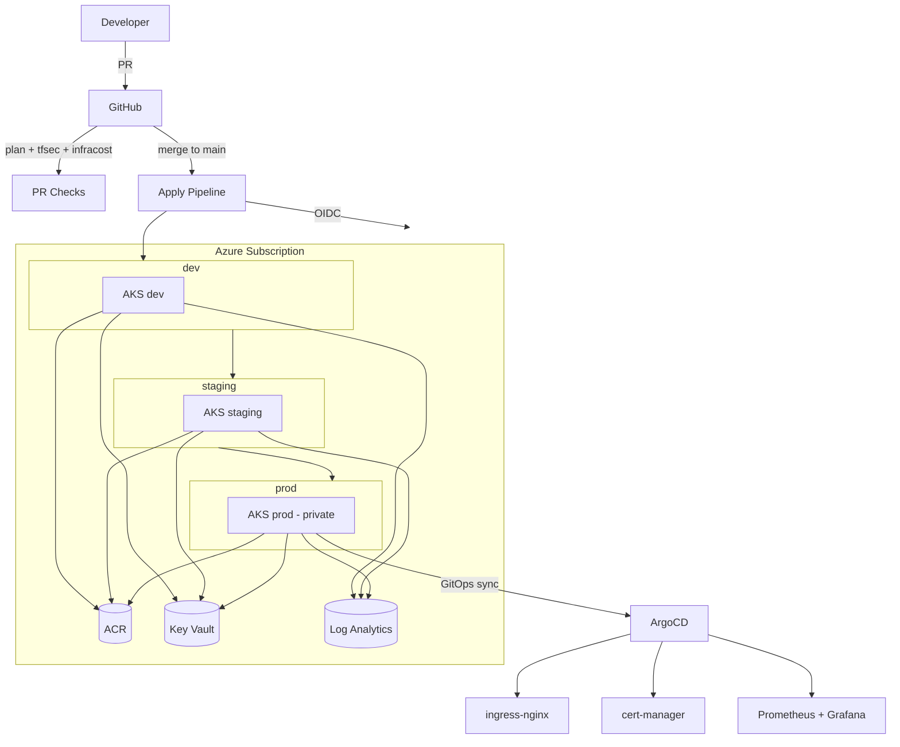

# AKS Multi-Environment Infrastructure with Terraform

Production-grade Infrastructure as Code that provisions fully isolated **dev / staging / prod** Azure Kubernetes Service (AKS) environments using Terraform, with a GitOps delivery layer (ArgoCD), full observability (Prometheus + Grafana), and a secure OIDC-based CI/CD pipeline on GitHub Actions.

> This repository is a portfolio reference implementation demonstrating enterprise patterns for running AKS at scale across multiple environments.

## Highlights

- **Reusable Terraform modules** — `network`, `aks`, `acr`, `keyvault`, `monitoring`, `gitops`
- **Three isolated environments** with environment-specific sizing, zones, and hardening
- **Remote state** in Azure Blob Storage with versioning and per-environment state keys
- **Keyless CI/CD** — GitHub Actions authenticates to Azure via OIDC (no stored secrets)
- **Promotion pipeline** — `dev → staging → prod` with environment-gated manual approvals
- **GitOps** — ArgoCD App-of-Apps bootstraps ingress-nginx, cert-manager, and the monitoring stack
- **Security baked in** — Azure Policy, Microsoft Defender for Containers, Calico network policy, Workload Identity, private API server in prod
- **Cost-aware** — autoscaling node pools, spot pools in dev, Infracost PR comments
- **Tested** — Terratest plan validation, tfsec + Checkov scanning, pre-commit hooks

## Architecture



## Repository layout

| Path | Purpose |
|------|---------|
| `modules/` | Reusable Terraform modules |
| `environments/` | Per-environment compositions (dev/staging/prod) |
| `bootstrap/` | One-time remote-state backend creation |
| `gitops/` | ArgoCD App-of-Apps manifests |
| `kubernetes/` | Kustomize base + overlays for the sample app |
| `app/` | Sample microservice deployed to the clusters |
| `tests/` | Terratest integration tests |
| `policies/` | Azure Policy definitions (policy-as-code) |
| `scripts/` | Helper scripts |
| `.github/` | CI/CD workflows and templates |

## Quick start

```bash
# 1. Authenticate
az login

# 2. Create the remote state backend (one time)
./scripts/bootstrap.sh

# 3. Deploy an environment
cd environments/dev
terraform init -backend-config=backend.dev.hcl
terraform plan  -var-file=terraform.tfvars
terraform apply -var-file=terraform.tfvars

# 4. Get cluster credentials
../../scripts/get-credentials.sh dev
kubectl get nodes
```

## CI/CD setup

Configure these repository secrets for OIDC auth: `AZURE_CLIENT_ID`, `AZURE_TENANT_ID`, `AZURE_SUBSCRIPTION_ID`, and optionally `INFRACOST_API_KEY`. Then create GitHub **Environments** named `dev`, `staging`, and `prod`, adding required reviewers to `staging` and `prod` to gate promotion.

See [`docs/SETUP.md`](docs/SETUP.md) for full instructions.

## Environment differences

| | dev | staging | prod |
|---|---|---|---|
| Node VM size | B2s | D2s_v5 | D4s_v5 |
| Availability zones | 1 | 1,2 | 1,2,3 |
| Private cluster | no | no | **yes** |
| Spot node pool | yes | no | no |
| ACR SKU | Standard | Standard | Premium |
| Log retention | 30d | 45d | 90d |

## License

MIT — see [LICENSE](LICENSE).
